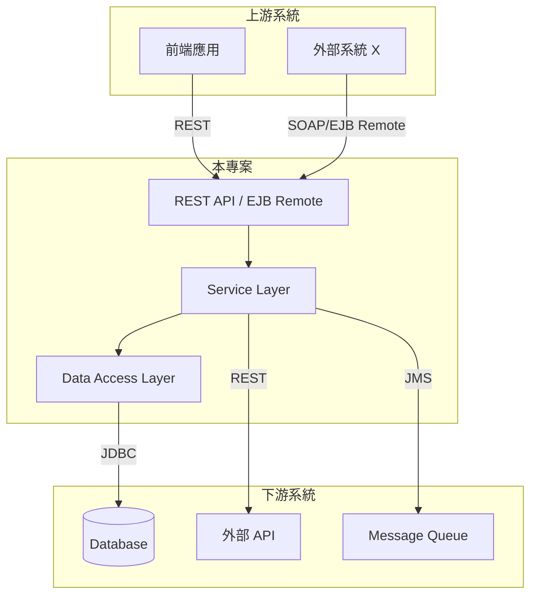

# Phase 2：上下游系統偵測

找出這個專案「呼叫了」哪些外部系統（下游），以及從設定中推斷哪些系統「呼叫它」（上游）。

前置：讀取 `analysis-memory/01-own-protocols.md`。

---

## Step 1：資料庫連線

```
Grep: jdbc:                    glob: **/*.properties
Grep: jdbc:                    glob: **/*.xml
Grep: jdbc:                    glob: **/*.yml
Grep: jdbc:                    glob: **/*.yaml
Grep: DataSource               glob: **/*.xml
Grep: spring\.datasource       glob: **/*.properties
Grep: spring\.datasource       glob: **/*.yml
Grep: jndi-name|jndi\.name     glob: **/*.xml
Grep: jndi-name|jndi\.name     glob: **/*.properties
```

**JDBC URL → 資料庫類型**：

| 關鍵字 | 資料庫 |
|---|---|
| `oracle` | Oracle |
| `mysql` | MySQL |
| `postgresql` | PostgreSQL |
| `sqlserver` / `jtds` | SQL Server |
| `db2` | DB2 |
| `h2` / `hsqldb` / `derby` | 嵌入式 DB |

記錄：資料庫類型、連線 URL、JNDI 名稱、連線池類型。

**搜尋存取的 Table**：

```
Grep: @Table\(name              glob: **/*.java
Grep: FROM\s+\w+|INSERT\s+INTO\s+\w+|UPDATE\s+\w+|DELETE\s+FROM\s+\w+  glob: **/*.java
Grep: FROM\s+\w+|INSERT\s+INTO\s+\w+|UPDATE\s+\w+|DELETE\s+FROM\s+\w+  glob: **/*.xml
```

---

## Step 2：REST Client

```
Grep: RestTemplate             glob: **/*.java
Grep: WebClient                glob: **/*.java
Grep: HttpClient               glob: **/*.java
Grep: OkHttpClient             glob: **/*.java
Grep: @FeignClient             glob: **/*.java
Grep: HttpURLConnection        glob: **/*.java
Grep: CloseableHttpClient      glob: **/*.java
```

搜尋 properties/yml 中的外部 URL：

```
Grep: https?://                glob: **/*.properties
Grep: https?://                glob: **/*.yml
Grep: https?://                glob: **/*.yaml
```

對每個 client 使用處：讀取檔案、找出目標 URL、記錄 HTTP Method、請求/回應型別、client 庫、檔案位置。

---

## Step 3：SOAP Client

```
Grep: Service\.getPort|\.call\(  glob: **/*.java
Grep: wsimport|wsdl2java        glob: **/pom.xml
Grep: wsimport|wsdl2java        glob: **/build.xml
Glob: **/generated/**/*Service.java
Glob: **/generated/**/*Port.java
Grep: wsdlLocation              glob: **/*.java
```

記錄：目標 WSDL、Service/Port name、呼叫的 operation、生成的 client class。

---

## Step 4：Message Queue（生產者端）

```
Grep: JmsTemplate              glob: **/*.java
Grep: KafkaTemplate            glob: **/*.java
Grep: RabbitTemplate           glob: **/*.java
Grep: ConnectionFactory        glob: **/*.java
Grep: \.send\(|\.convertAndSend\(  glob: **/*.java
Grep: spring\.kafka|spring\.rabbitmq|spring\.jms  glob: **/*.properties
Grep: spring\.kafka|spring\.rabbitmq|spring\.jms  glob: **/*.yml
```

記錄：MQ 類型、Broker URL、Queue/Topic 名稱、消息格式、生產者位置。

---

## Step 5：Cache

```
Grep: RedisTemplate|JedisPool|Redisson|Lettuce  glob: **/*.java
Grep: @Cacheable|@CacheEvict|@CachePut  glob: **/*.java
Grep: spring\.redis|spring\.cache  glob: **/*.properties
Grep: spring\.redis|spring\.cache  glob: **/*.yml
Glob: **/ehcache*.xml
Grep: MemcachedClient          glob: **/*.java
```

---

## Step 6：LDAP

```
Grep: LdapTemplate|DirContext|LdapContext  glob: **/*.java
Grep: ldap://|ldaps://         glob: **/*.properties
Grep: ldap://|ldaps://         glob: **/*.xml
Grep: spring\.ldap             glob: **/*.properties
```

---

## Step 7：Email（SMTP）

```
Grep: JavaMailSender|MimeMessage|SimpleMailMessage  glob: **/*.java
Grep: mail\.smtp|spring\.mail  glob: **/*.properties
Grep: mail\.smtp|spring\.mail  glob: **/*.yml
```

---

## Step 8：檔案系統 / FTP / SFTP

```
Grep: FTPClient|FTPSClient     glob: **/*.java
Grep: JSch|ChannelSftp         glob: **/*.java
Grep: ftp://|sftp://           glob: **/*.properties
Grep: FileInputStream|FileOutputStream|Files\.  glob: **/*.java  (limit: 20)
```

重點找「與外部系統交換檔案」的操作，非一般本地讀寫。

---

## Step 9：其他外部連線

```
Grep: ElasticsearchClient|RestHighLevelClient  glob: **/*.java
Grep: MongoClient|MongoTemplate  glob: **/*.java
Grep: InfluxDB|InfluxDBClient  glob: **/*.java
Grep: Socket\(|ServerSocket    glob: **/*.java
```

掃描 pom.xml/build.gradle 依賴，找出未在前面步驟識別到的 client 庫。

---

## 輸出格式

### 文件 1：`analysis-memory/02-upstream-downstream.md`

```markdown
# Phase 2：上下游系統偵測結果

## 上游系統（誰呼叫這個專案）

| 上游系統 | 呼叫方式 | 接口 | 證據 |
|---|---|---|---|
> 上游系統通常無法 100% 確認，標記「⚠ 推斷」。

## 下游系統（這個專案呼叫誰）

### 資料庫
| 資料庫 | 類型 | 連線方式 | 存取的 Table |
|---|---|---|---|

### 外部 REST API
| 目標系統 | URL | HTTP Method | Client 庫 | 呼叫方 |
|---|---|---|---|---|

### 外部 SOAP 服務
| 目標系統 | WSDL | Operations | 呼叫方 |
|---|---|---|---|

### Message Queue（生產）
| MQ 類型 | Broker | Queue/Topic | 消息格式 | 生產者 |
|---|---|---|---|---|

### Cache
| 類型 | 連線 | 使用方式 |
|---|---|---|

### 其他
（LDAP、SMTP、FTP、Elasticsearch 等，偵測到才列）

## 介面彙總
| # | 方向 | 類型 | 對象 | 介面/路徑 | 資料格式 |
|---|---|---|---|---|---|
```

### 文件 2：`analysis-memory/02-system-overview.md`

包含 Mermaid 系統邊界圖和技術棧摘要。



依實際偵測結果調整。
