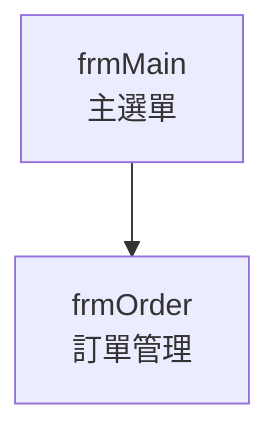

# 表單盤點

## 呼叫時機

- **階段**：Phase 2
- **觸發方式**：使用者說 `/form-inventory` 或「繼續」（Phase 1b 完成後自動銜接）
- **前置條件**：Phase 1a + 1b 已完成
- **後續 skill**：`/form-analysis`（Phase 3，逐表單執行）

## 前置輸入

1. `memory-bank/progress.md` — 確認 Phase 1a、1b 已完成
2. `memory-bank/01-project-structure.md` — 取得 Form 檔案清單

## 執行步驟

### Step 1：收集所有 Form

從 `01-project-structure.md` 取得 Form 清單。如不完整，補充搜尋 `Inherits System.Windows.Forms.Form` 和 `Inherits Form`。

### Step 2：分析每個 Form 的控件

讀取每個 Form 的 `.Designer.vb` 檔案，搜尋 `Friend WithEvents` 或 `Private WithEvents` 宣告。

將控件分類為：

| 分類 | 控件類型 |
|---|---|
| 資料輸入 | TextBox, ComboBox, DateTimePicker, NumericUpDown, CheckBox, RadioButton, MaskedTextBox |
| 資料顯示 | Label, DataGridView, ListView, TreeView, RichTextBox |
| 動作觸發 | Button, ToolStripButton, ToolStripMenuItem, MenuStrip |
| 容器 | Panel, GroupBox, TabControl, SplitContainer |
| 其他 | Timer, BackgroundWorker, BindingSource, ErrorProvider |

### Step 3：分析 Form 間呼叫關係

在所有 `.vb` 檔案中搜尋：

- `New {FormName}` — 建立 Form 實例
- `.Show()`, `.ShowDialog()` — 顯示 Form

記錄呼叫方和被呼叫方。

### Step 4：識別共用 UserControl

列出所有 UserControl，搜尋它們在哪些 Form 的 `.Designer.vb` 中被使用。

### Step 5：產出 Mermaid 呼叫關係圖

根據 Step 3 結果產出 Form 間的呼叫關係圖。

## 輸出

寫入 `memory-bank/03-form-inventory.md`：

```markdown
# Form 盤點結果

## 統計摘要
- Form 總數：{count}
- UserControl 總數：{count}
- 控件總數：{count}

## Form 清單

### {FormName}
- 檔案：{file path}
- 推測用途：{inferred from name and controls}
- 控件統計：
  - 資料輸入：{n} 個（{list}）
  - 資料顯示：{n} 個（{list}）
  - 動作觸發：{n} 個（{list}）
  - 其他：{n} 個（{list}）
- 複雜度評估：🟢 低 / 🟡 中 / 🔴 高
- 呼叫的 Form：{list}
- 被呼叫自：{list}

## 建議分析順序
| 順序 | Form 名稱 | 原因 |
|---|---|---|

## Form 呼叫關係圖



## 共用 UserControl
| UserControl | 用途 | 使用的 Form |
|---|---|---|
```

## 更新進度

更新 `memory-bank/progress.md`：
- 將「Phase 2」狀態改為 `✅ 完成`
- 在 Phase 3 表格中填入所有 Form 名稱，狀態設為 `⬜ 未開始`
