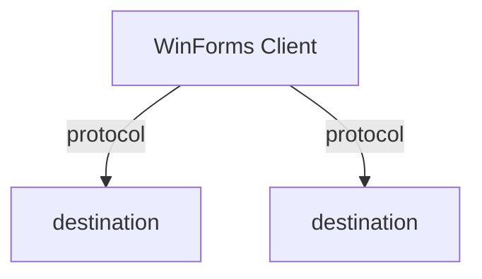

# 通訊協定偵測

## 前置輸入

1. `memory-bank/progress.md` — 確認 Phase 1a 已完成
2. `memory-bank/01-project-structure.md` — 了解有哪些檔案需要搜尋

## 執行步驟

### Step 1：偵測資料庫連線

在所有 `.vb` 和 `.config` 檔案中搜尋：

| 搜尋模式 | 對應技術 |
|---|---|
| `SqlConnection`, `SqlCommand`, `SqlDataAdapter` | ADO.NET（SQL Server） |
| `OracleConnection`, `OracleCommand` | ADO.NET（Oracle） |
| `OleDbConnection`, `OleDbCommand` | OLE DB |
| `OdbcConnection` | ODBC |
| `MySqlConnection` | MySQL Connector |
| `DbContext`, `ObjectContext` | Entity Framework |
| `DataSet`, `TableAdapter`, `.Fill(` | 強型別 DataSet / TableAdapter |

### Step 2：偵測外部通訊

| 搜尋模式 | 對應技術 |
|---|---|
| `WebRequest`, `HttpWebRequest`, `WebClient` | HTTP 通訊 |
| `HttpClient` | 現代 HTTP 通訊 |
| `ServiceReference`, `WebReference` | Web Service / WCF 用戶端 |
| `SoapHttpClientProtocol` | SOAP Web Service |
| `ChannelFactory`, `ServiceHost` | WCF |
| `RemotingConfiguration`, `MarshalByRefObject` | .NET Remoting |
| `TcpClient`, `UdpClient`, `Socket` | 原生 Socket |
| `SerialPort` | 串列埠通訊 |

### Step 3：找出連線字串

依優先順序搜尋：

1. `App.config` 或 `Web.config` 中的 `<connectionStrings>` 區段
2. 程式碼中硬編碼的 `ConnectionString` 賦值
3. `.settings` 檔案中的連線設定
4. Registry 讀取（搜尋 `Registry.GetValue`、`RegistryKey`）

### Step 4：偵測資料序列化

| 搜尋模式 | 對應技術 |
|---|---|
| `XmlSerializer`, `XmlDocument`, `XDocument` | XML |
| `JsonConvert`, `JavaScriptSerializer` | JSON |
| `BinaryFormatter`, `SoapFormatter` | 二進位 / SOAP 序列化 |

### Step 5：讀取上下文確認

對每個搜尋命中，讀取前後 5 行程式碼，確認實際用途並記錄。

## 輸出

寫入 `memory-bank/02-protocols.md`：

```markdown
# 通訊協定偵測結果

## 資料庫連線
- 技術：{ADO.NET / Entity Framework / ...}
- 資料庫類型：{SQL Server / Oracle / ...}
- 連線字串位置：{file:line}
- 連線字串內容：{sanitized connection string}

## 外部通訊
| 協定 | 用途 | 使用位置 | 程式碼片段 |
|---|---|---|---|

## 資料序列化
| 格式 | 用途 | 使用位置 |
|---|---|---|

## 系統架構圖



## 重要發現
{特殊的通訊模式、值得注意的實作方式}
```

## 更新進度

更新 `memory-bank/progress.md`：將「Phase 1b」狀態改為 `✅ 完成`，填入完成日期。
