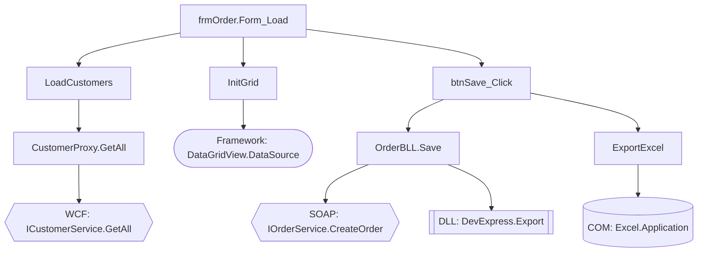

# Form Deep Trace（DFS 完整追蹤）

## 呼叫時機

- **觸發方式**：使用者說「深追 {FormName}」或「deep trace {FormName}」
- **前置條件**：`memory-bank/forms/{FormName}.md` 已存在（form-analysis 已執行過）
- **用途**：補足 form-analysis 因行數限制或追蹤深度限制而遺漏的程式碼細節

## 與 form-analysis 的差異

form-analysis 廣度優先、limit 行數、最多 10 層、產出結構化摘要。本 skill 為 **DFS 深度優先、禁止 limit、無深度限制、逐方法逐行完整展開**。

## 核心規則

1. **禁止 limit 行數**：所有 Read 操作必須讀取完整檔案。若檔案超過工具限制，分段讀取直到讀完。
2. **DFS 策略**：遇到方法呼叫立即跳入追蹤，追完該分支再回到上層繼續。
3. **追蹤終止條件**（僅以下情況停止追蹤）：
   - 方法執行到 `Return` / `End Sub` / `End Function`
   - 呼叫目標為 .NET Framework 內建類別（System.*、Microsoft.*）
   - 呼叫目標為第三方 DLL（無原始碼）
   - 呼叫目標為 COM 元件（無原始碼）
4. **禁止跳過**：任何 If-Else、Select Case、Try-Catch、For/While 迴圈的每一個分支都必須追蹤。
5. **禁止猜測**：所有邏輯必須基於實際讀取的程式碼。無法讀取的標記為「⚠ 無法讀取：{原因}」。

## 執行步驟

### Step 1：載入既有分析

讀取 `memory-bank/forms/{FormName}.md`，從中提取：
- 所有已識別的事件處理方法（Form_Load、Button_Click、控件事件等）
- 所有已識別的跨檔案呼叫（Part D 呼叫鏈中出現的方法）
- 所有標記為「追蹤截斷」或「⚠ 待確認」的項目

建立 **DFS stack**（初始內容：Form_Load、所有 Button_Click、控件事件方法、Timer 事件、既有分析中標記為「追蹤截斷」的方法）和 **visited set**（防止重複追蹤）。

### Step 2：DFS 追蹤迴圈

從 stack 取出一個方法，執行以下流程：

**2a：讀取完整原始碼**

定位方法所在檔案，讀取**完整檔案**（禁止 limit）。找到目標方法的起始行與結束行。

**2b：逐行分析**

對方法內的每一行程式碼，分類記錄：

| 類別 | 說明 | 動作 |
|---|---|---|
| 變數宣告 | Dim、Private、Public 變數 | 記錄名稱、型別、初始值 |
| 賦值 | `x = expression` | 記錄完整表達式，追蹤右側來源 |
| 條件分支 | If-Else、Select Case | **每個分支獨立追蹤，全部記錄** |
| 迴圈 | For、For Each、While、Do Loop | 記錄迴圈條件與迴圈體邏輯 |
| 方法呼叫 | `obj.Method()` / `Module.Method()` | 判斷是否為專案內方法（見 2c） |
| 遠端呼叫 | WCF / Web API / SOAP / gRPC / Remoting | 記錄協定類型、介面、endpoint URL / host（見 2d） |
| 錯誤處理 | Try-Catch-Finally | 記錄範圍、Exception 類型、處理邏輯 |
| 事件觸發 | RaiseEvent | 搜尋所有 Handler，加入 stack |
| Return | Return value / End Sub | 記錄回傳值，結束此方法追蹤 |

**2c：方法呼叫判斷與遞迴**

遇到方法呼叫時：

1. **排除判斷**：
   - 目標 namespace 為 `System.*`、`Microsoft.*` → 記錄為「[Framework] {完整呼叫}」，不追蹤
   - 目標為第三方 DLL（專案中無 .vb 原始碼） → 記錄為「[DLL] {元件名稱}.{方法}」，不追蹤
   - 目標為 COM Interop → 記錄為「[COM] {元件名稱}.{方法}」，不追蹤

2. **專案內方法**：
   - 搜尋 `Sub {MethodName}` 或 `Function {MethodName}`
   - 若在 visited set 中 → 記錄為「[已追蹤] → 見 {方法名稱} 段落」，不重複追蹤
   - 若不在 visited set 中 → 加入 visited set，**立即跳入追蹤**（DFS），追完後回到當前行繼續

3. **無法定位**：
   - Grep 搜尋全專案仍找不到定義 → 記錄為「⚠ 找不到定義：{方法名稱}，可能為動態呼叫或外部元件」

**2d：遠端呼叫記錄**

遇到遠端服務呼叫時，必須識別並記錄以下資訊：

1. **協定類型判斷**：WCF（`ChannelFactory<T>`/`ClientBase<T>`/`ServiceReference`/config 的 `<system.serviceModel>`）、Web API/REST（`HttpClient`/`WebClient`/`HttpWebRequest`）、SOAP（`SoapHttpClientProtocol`/`.asmx` proxy）、.NET Remoting（`Activator.GetObject`）、gRPC（`GrpcChannel`）、Named Pipe/Socket（`NamedPipeClientStream`/`TcpClient`/`Socket`）
2. **介面/合約**：記錄 Service Interface 名稱（如 `IOrderService`）、方法名稱、參數型別
3. **Endpoint URL / Host**：搜尋 `app.config`/`web.config` 的 `<endpoint address="`、`<add key="`、程式碼中 URL 字串或 `ConfigurationManager.AppSettings`。記錄完整 URL 或 host:port
4. **請求參數**：追蹤傳入遠端呼叫的每個參數來源（向上追蹤變數賦值鏈）
5. **Response 處理**：追蹤回傳值的完整流向 — 回傳型別（DTO class / DataSet / string / XML）、取用了哪些欄位（如 `result.CustomerName`、`result.Items`）、欄位流向何處（賦值給哪個變數 → 顯示到哪個 UI 控件 / 傳入哪個方法 / 存入哪個集合）、是否有轉換邏輯（型別轉換、格式化、條件判斷）、錯誤判斷（null check、error code 檢查、Try-Catch）

### Step 3：產出報告（追蹤完所有 stack 中的方法後）

## 輸出

寫入 `memory-bank/forms/{FormName}-deep-trace.md`：

```markdown
# {FormName} DFS 深度追蹤結果

## 追蹤統計

| 項目 | 數量 |
|---|---|
| 追蹤的方法總數 | N |
| 專案內方法 | N |
| Framework 呼叫 | N |
| DLL/COM 呼叫 | N |
| 遠端呼叫 | N |
| 無法定位的方法 | N |
| 追蹤的檔案數 | N |

## 方法追蹤索引

| # | 方法名稱 | 所屬類別/模組 | 檔案位置 | 呼叫來源 | 類別 |
|---|---|---|---|---|---|
| 1 | Form_Load | {FormName} | {file}:{line} | [入口] | 事件 |
| 2 | SaveOrder | OrderBLL | {file}:{line} | btnSave_Click | 商業邏輯 |

## 完整追蹤記錄

### {方法名稱}（{所屬類別}）

**檔案**：{file}:{startLine}-{endLine}
**呼叫來源**：{caller} → {this method}
**回傳型別**：{type}

**逐行邏輯**：

```
L15: Dim client As New OrderServiceClient()
     [變數宣告] WCF Proxy, 介面: IOrderService
L16: request.OrderID = orderID
     [賦值] OrderID ← orderID ← btnSearch_Click 的 txtOrderID.Text（frmOrder.vb:42）
L17: Dim result = client.GetOrder(request)
     [遠端呼叫] WCF | IOrderService.GetOrder | host: app.config endpoint "OrderService"
     [Response] 型別: OrderDTO
L18: If result IsNot Nothing Then
     [Response 錯誤判斷] null check
L19:     lblName.Text = result.CustomerName
         [Response 欄位流向] .CustomerName → lblName（UI 顯示）
L20:     txtTotal.Text = result.Total.ToString("N2")
         [Response 欄位流向] .Total → txtTotal（格式化: N2）
```

（每個追蹤到的方法重複以上格式）

## 遠端呼叫彙總

| # | 協定類型 | 介面 | 方法 | Endpoint / Host | 請求參數 | Response 型別 | Response 欄位用途 | 呼叫位置 |
|---|---|---|---|---|---|---|---|---|
| 1 | WCF (NetTcp) | IOrderService | GetOrder | net.tcp://order-server:8080 | orderID ← txtOrderID.Text | OrderDTO | .CustomerName→lblName, .Total→txtTotal | OrderProxy.vb:35 |

## 外部邊界呼叫彙總

| # | 邊界類型 | 完整呼叫 | 所在方法 | 呼叫位置 |
|---|---|---|---|---|
| 1 | [Framework] | System.Data.DataTable.Select() | LoadData | DataHelper.vb:22 |
| 2 | [DLL] | DevExpress.XtraGrid.GridControl.RefreshData() | RefreshUI | frmOrder.vb:95 |
| 3 | [COM] | Excel.Application.Workbooks.Open() | ExportExcel | ExportHelper.vb:15 |

## 未解決項目

| # | 類型 | 內容 | 位置 | 原因 |
|---|---|---|---|---|
| 1 | ⚠ 找不到定義 | ThirdPartyHelper.Process() | frmOrder.vb:88 | 可能為外部 DLL |

## Mermaid 呼叫鏈圖

以 `flowchart TD` 產出，節點形狀區分類型：

- `[方法名]` — 專案內方法（矩形）
- `{{遠端: 協定 | 介面.方法}}` — 遠端呼叫（六角形）
- `([Framework: 呼叫])` — .NET Framework（圓角矩形）
- `[[DLL: 元件.方法]]` — 第三方 DLL（雙框矩形）
- `[(COM: 元件.方法)]` — COM 元件（圓柱形）


```

## 更新進度

更新 `memory-bank/progress.md`，記錄 `{FormName} 深度追蹤已完成` 和追蹤統計摘要。

## 範例

「深追 frmOrder」→ 讀取 frmOrder.md → DFS 所有事件方法 → 遠端呼叫記錄協定/介面/host/response流向 → Framework/DLL/COM 記錄邊界 → 產出 `frmOrder-deep-trace.md`（含彙總表 + Mermaid 圖）
